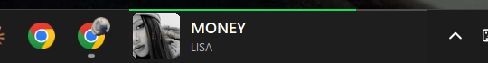

# Spotify Taskbar Widget

A minimal **Spotify "now playing" widget that lives inside the Windows 11 taskbar** — album art, track/artist, a progress bar, and a real-time audio spectrum, styled to look like an official Spotify component. It appears only while Spotify is running and reacts only to Spotify's own audio.



## Features

- **Sits in the taskbar** — docks into the taskbar band (next to the clock) as an always-on-top bar. Windows 11 removed the classic taskbar toolbar API, so the widget positions itself precisely over the taskbar and blends with its color.
- **Album art + track / artist + progress bar** — pulled from Windows' media session, no login or API key required.
- **Real-time audio spectrum** — captures the system audio output (WASAPI loopback) and runs an FFT to draw Spotify-green frequency bars.
- **Reacts only to Spotify** — the spectrum is gated by Spotify's own audio-session level (via the Windows volume mixer), so other apps' sound never drives the bars.
- **Click controls** — 1 click = play/pause, 2 clicks = next track, 3 clicks = previous track.
- **Scroll to set volume** — the mouse wheel over the widget adjusts **only Spotify's** volume (per-app, not the system master), with an on-widget level indicator.
- **Scrolling title** — long track names scroll smoothly (marquee) instead of being truncated.
- **Smart visibility** — shows only when Spotify is open with a track, hides automatically during fullscreen apps (movies/games), and disappears when Spotify is closed.
- **Theme-aware** — the background follows the taskbar color (dark/light theme or accent color).

## Requirements

- Windows 11
- Python 3.12+
- An NVIDIA/other GPU is **not** required (audio only)

Python packages (see `requirements.txt`):

```
numpy · psutil · Pillow · winsdk · soundcard · pycaw
```

## Install

```bash
pip install -r requirements.txt
```

## Run

Double-click **`baslat.vbs`** (launches silently, no console window), or run:

```bash
pythonw widget.py
```

The bar appears in the taskbar once Spotify is playing/paused with a track loaded. Right-click the widget to close it.

## Controls

| Action | Result |
| --- | --- |
| 1 click on cover | Play / Pause |
| 2 clicks on cover | Next track |
| 3 clicks on cover | Previous track |
| Scroll wheel over widget | Adjust Spotify volume (Spotify only) |
| Right click | Close |

## How it works

- **Placement** — a borderless top-most window is positioned over `Shell_TrayWnd` (the taskbar) via `SetWindowPos`, re-anchored every second so it stays in place when the taskbar reflows.
- **Metadata** — `GlobalSystemMediaTransportControlsSessionManager` (GSMTC) provides title/artist/album, cover art, and playback position.
- **Spectrum** — `soundcard` captures WASAPI loopback; NumPy computes an FFT reduced to log-spaced bars.
- **Spotify-only gating** — `pycaw` reads Spotify's audio-session peak; the spectrum only animates while Spotify itself produces sound.
- **Controls** — play/pause uses the media session's `try_toggle_play_pause`; next/previous send `WM_APPCOMMAND` directly to the Spotify window (reliable even while paused).

## Configuration

Tunable constants live at the top of `widget.py`: `WIDTH`, `BARS` (spectrum bar count), colors, and `CLICK_MS` (multi-click window).

## License

MIT — see [LICENSE](LICENSE).
